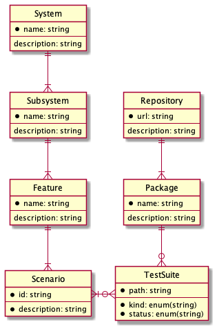

# Filecoin System Test Matrix

> 💊😎 The "Red Pill" for Filecoin node implementations

The Filecoin System Test Matrix is a dashboard with a detailed list of Filecoin features and behaviors and a mapping between those features and test suites, systems and subsystems that those features are related to.

The main goal of this project is closing the discrepancy between specification and the actual state of implementations.

- The official resource for the expected behavior of Filecoin node implementations is the Filecoin Specification [^1]. It is written as *prose* and it's quite verbose (*and that's the way it should be*).
- The System Test Matrix can be used to evaluate the state of Filecoin node implementations (such as lotus [^2], venus [^3] etc) *at a glance* and help new contributors understand how the Filecoin network works. 

## How it works?

Here's the (simplified) lifecycle flow for the System Test Matrix:

1. Filecoin contributors with domain knowledge write new requirements (features) and submit them via a PR to one of the Filecoin repositories. The features are enumerated inside one or more large YAML files.
2. After the PR is reviewed and accepted, the new content is parsed and the build script enriches the input data with test status information, fetched from the CI.
3. The "rich data" input is transformed into the **System Test Matrix Table**. This table is basically the end result of our work. 
4. Users can browse this table and:
    1. See the desired behavior of each feature
    2. Click on links that lead to test files that test that behavior
    3. Perform various visualizations such as grouping by feature, system, subsystem etc
5. This table will should be embeddable (or at least linked to) inside other websites, such as the Filecoin Specification [^1]

## The Data Model

### Legend
- _System_: A system as identified by the specification. One of: 
    1. Filecoin Nodes
    2. Files & Data
    3. Virtual Machine
    4. Blockchain
    5. Token
    6. Storage Mining
    7. Markets
- _Subsystem_: A logical part of one of the systems listed above. See each system spec and implementation for possible subsystems.
- _Feature_: A component that implements a specific behaviour.
- _Scenario_: One specific behaviour of a _Feature_.
- _Test Suite_: A path to a test file in the Lotus repository[^1] that implements the test for a certain _Test Scenario_

### Example
Let's look at a simple (textual) example:
- There is a feature called: `FileImport`
- One scenario is: `Given a non-empty file, produce a .car file with identical contents, padded up to a power of 2`
- The tests for this scenario are implemented inside: `node/impl/client/client_test.go` which is of `kind="integration"` and it's passing
- It belongs to the `Client` subsystem inside the `Files&Data` system [^4]

## Contributing

- To generate diagrams from PlantUML files use: `make diagrams`

---
[^1]: https://spec.filecoin.io/
[^2]: https://github.com/filecoin-project/lotus
[^3]: https://github.com/filecoin-project/venus
[^4]: https://spec.filecoin.io/#section-systems.filecoin_files.piece.data-representation